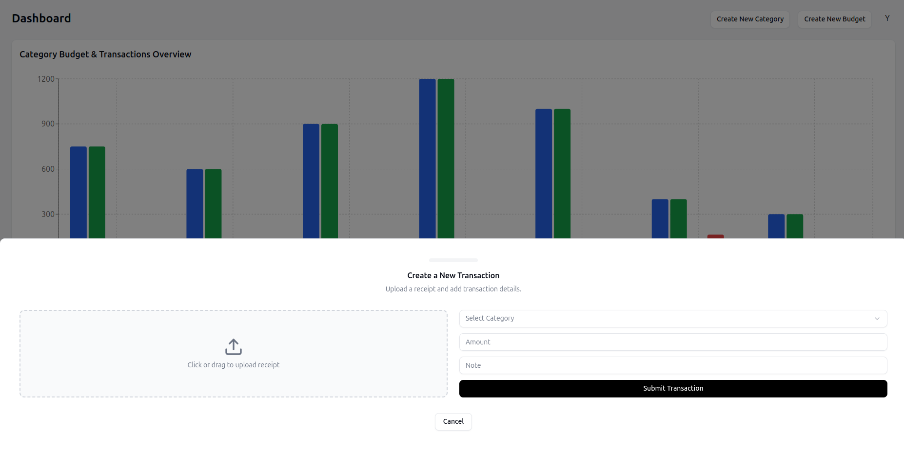
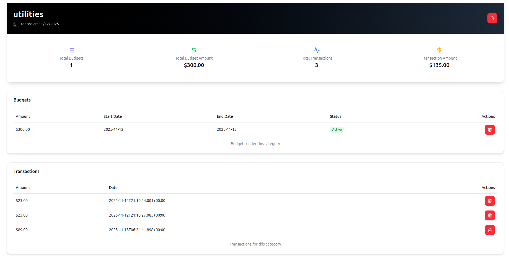
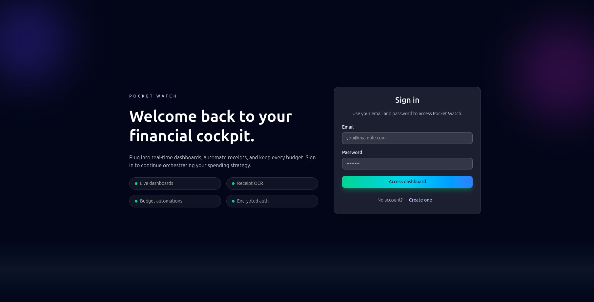
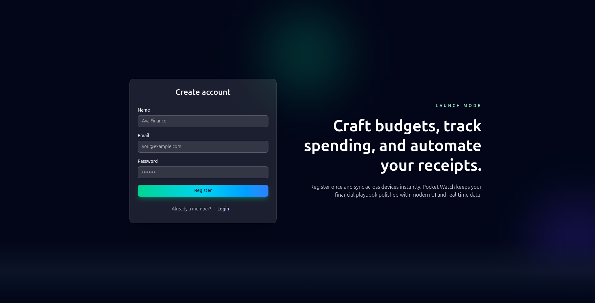

# Pocket Watch

Pocket Watch is a smart expense tracking and budgeting application that helps users manage their finances efficiently. It provides features like OCR-based receipt scanning, categorized transactions, spending insights, and a simple, elegant interface built with modern tools.

🚀 Features

💸 Add Transactions Easily — Record income and expenses with just a few taps.

🧾 AI-Powered OCR Receipt Scanning — Automatically extract transaction details from receipt images using Tesseract.js OCR + OpenAI AI for intelligent categorization and data extraction.

📊 Visual Budget Insights — View your spending habits with clean charts and analytics.

🤖 AI Spending Insights — Get intelligent spending analysis, budget warnings, and personalized financial recommendations powered by AI.

🗂️ Category Management — Organize expenses by categories like Food, Transport, Bills, etc.

🔒 Secure User Authentication — Login and manage your data safely (e.g., via Supabase).

🌙 Modern UI — Built using ShadCN UI, React, and TailwindCSS for a clean and responsive experience.

# Screenshots

🧠 Tech Stack

Frontend: React + Vite

UI Components: ShadCN UI + TailwindCSS

OCR Engine: Tesseract.js

AI Service: Google Gemini Pro (FREE tier available, falls back to regex-based extraction)

Backend: Supabase (Auth + Database)

State Management: React Hooks / Context API

Charts: Chart.js or Recharts

⚙️ Installation & Setup

Clone the repository

git clone https://github.com/yaftes/pocket-watch.git
cd pocket-watch

Install dependencies

npm install

Set up environment variables
Create a .env file in the root folder and add:

VITE_SUPABASE_URL=your_supabase_url
VITE_SUPABASE_ANON_KEY=your_supabase_key

# Optional: For AI-powered receipt parsing and insights (FREE with Google Gemini)

VITE_GEMINI_API_KEY=your_gemini_api_key

Run the app

npm run dev

## 🤖 AI Features

Pocket Watch includes powerful AI features powered by OpenAI:

### Automatic Receipt Processing

- **OCR + AI Extraction**: Upload a receipt image and the app will:
  - Extract text using Tesseract.js OCR
  - Use AI to intelligently extract amount, date, merchant, and items
  - Automatically categorize the transaction
  - Create the transaction automatically (no manual input needed!)

### Smart Categorization

- AI analyzes receipt content to match transactions to the most appropriate category
- Falls back to keyword-based categorization if AI is unavailable
- Learns from your existing categories

### Spending Insights

- Get real-time budget warnings when approaching limits
- Receive spending pattern analysis
- AI-powered suggestions for budget optimization

**Note**: AI features work without an API key (using regex fallback), but for best results, add your free Google Gemini API key to `.env`. Get your free API key at https://makersuite.google.com/app/apikey
